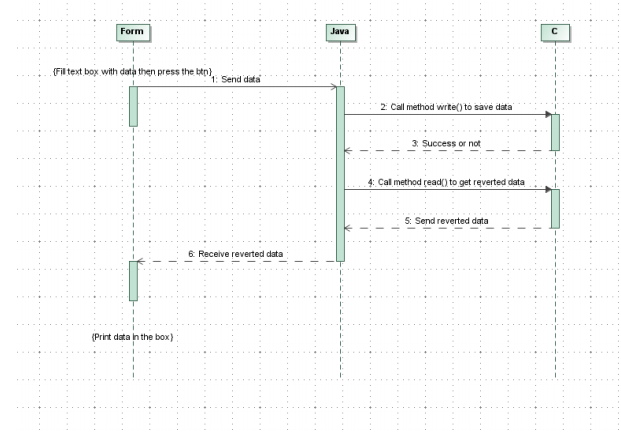

# Project Title

Current project demonstrates usage of Java JNA to call C functions from .so library.

Resulting app corresponds to following sequence diagram:

### Run

The current Makefile has been tested only on Linux system.

To compile and run, just do:

```
make
```

## Resulting app


## Usefull resources

# How to create a shared object
* https://www.cprogramming.com/tutorial/shared-libraries-linux-gcc.html - Shared libraries with GCC on Linux
* https://renenyffenegger.ch/notes/development/languages/C-C-plus-plus/GCC/create-libraries/index - Creating a shared and static library with the gnu compiler (gcc)

# How to use JNA
* https://github.com/java-native-access/jna/blob/master/www/GettingStarted.md - JNA Getting Started
* https://ru.intechcore.com/jna-for-access-to-native-com-dll-library/ - Using JNA to call .NET from java